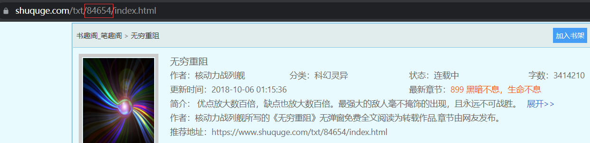

# novelS
可自定义的小说爬虫（python2 not support）

## 用法

```shell
> python3 main.py --help
usage: main.py [-h] [-o OPTION] [-b BOOKID] [-r RETRY]

optional arguments:
  -h, --help            show this help message and exit
  -o OPTION, --option OPTION
                        choose your option
  -b BOOKID, --bookid BOOKID
                        book id in the website
  -r RETRY, --retry RETRY
                        retry nums when encount HTTP error or anti-spider mechanism
```

**用例**

以此书为例，从书页url中取得id，选择网站匹配得模板，进行下载
```shell
> python3 main.py -o first -b 84654
```


## 模板定制

参考`option/resource`下的模板文件


